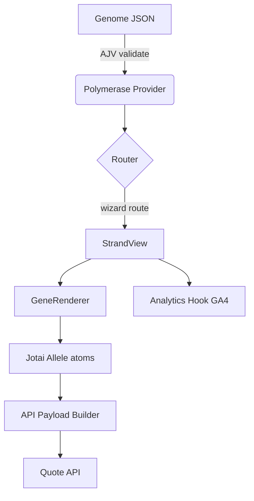

# Implementing Config-Driven Journeys in Helixium Web

*Status: Draft – v0.1*

This document translates the conceptual design of the **Genome / Strand / Gene** journey system into concrete implementation steps that fit Helixium’s current front-end stack.

---

## 1. Relevant Existing Technologies

| Area | Current Stack | Notes |
|------|---------------|-------|
| Build | **Vite** + React 18 | Fast dev server & HMR. |
| Routing | **@tanstack/router** file-based routes (e.g. `routes/__root.tsx`) | Supports SPA wizard flows. |
| State | **Jotai** | Atom-based, simple to scope to individual journeys. |
| Styling | **Chakra UI** (implicit via component patterns) | Can generate form controls quickly. |
| Animations | `PageTransition` component | Handles fade transitions; extensible. |
| Testing | Playwright E2E + Jest/Vitest unit tests | Must cover journey engine & schema validation. |
| CI/CD | GitHub Actions → ECR/ECS deploy | Add JSON-schema validation job. |

---

## 2. High-Level Architecture



1. **Genome Loader** fetches & validates config.
2. **PolymeraseProvider** exposes journey context (`currentStrand`, navigation helpers, atoms).
3. A dedicated **wizard route** (`/quote/*`) renders `StrandView` which displays one or more `GeneRenderer` components according to the Genome.
4. Answers flow into **Allele atoms**; a separate hook builds the outbound payload.
5. **GA4 Analytics** events fire at key touch points.

---

## 3. File/Folder Layout Proposal

```
helixium-web/
└─ src/
   ├─ genomes/
   │   └─ car-insurance-v0.1.json      # Genome configs (versioned)
   ├─ features/
   │   └─ journey-engine/
   │      ├─ components/
   │      │   ├─ StrandView.tsx        # Renders a Strand’s title + Genes
   │      │   └─ GeneRenderer.tsx      # Chooses control based on gene.type
   │      ├─ hooks/
   │      │   ├─ usePolymerase.ts      # Consumes context
   │      │   └─ useGenomeLoader.ts    # Fetch + AJV validate
   │      ├─ PolymeraseProvider.tsx    # Top-level context provider
   │      ├─ atoms.ts                  # Allele atoms creator
   │      └─ utils/payloadBuilder.ts   # Maps Alleles → API payload
   └─ routes/
      └─ quote.tsx                     # Wizard router entry
```

> 🗂 *Rationale*: Keeping the engine within its own feature folder (`journey-engine`) aligns with Helixium’s Bulletproof React conventions while allowing other features to remain isolated.

---

## 4. Implementation Details

### 4.1 Genome Loader & Validation

```ts
// journey-engine/hooks/useGenomeLoader.ts
import Ajv, {JSONSchemaType} from 'ajv'
import genomeSchema from '@/genomes/schema/genome.schema.json'

export function useGenomeLoader(path: string) {
  const [genome, setGenome] = useState<Genome | null>(null)
  useEffect(() => {
    fetch(path)
      .then(res => res.json())
      .then(data => {
        const ajv = new Ajv()
        const validate = ajv.compile<Genome>(genomeSchema)
        if (!validate(data)) throw new Error('Invalid genome config')
        setGenome(data)
      })
  }, [path])
  return genome
}
```

* CI step*: add `yarn validate:genomes` that runs `ajv-cli validate -s genome.schema.json -d "src/genomes/**/*.json"`.

### 4.2 Context & Atoms

```ts
// journey-engine/atoms.ts
export const alleleAtoms = (genome: Genome) =>
  Object.fromEntries(
    genome.strands.flatMap(s =>
      s.genes.map(g => [g.id, atom<unknown | null>(null)])
    )
  )
```

The `PolymeraseProvider` creates these atoms *once per journey instance* using `React.useMemo`.

### 4.3 Routing Strategy

* Define a single file route `routes/quote.tsx` which mounts `PolymeraseProvider` and renders `StrandView`.
* Internal navigation uses `useNavigate()` from `@tanstack/router` but stays under `/quote` so the URL reflects progress (`/quote/2` for second Strand).
* `PageTransition` wraps the `Outlet` to reuse existing fade animations.

### 4.4 Gene Rendering

Create a map of control components:

```tsx
// journey-engine/components/GeneRenderer.tsx
const registry = {
  text: TextGene,
  number: NumberGene,
  date: DateGene,
  singleChoice: RadioGene,
  multiChoice: CheckboxGene,
} as const

export const GeneRenderer = ({gene}: {gene: Gene}) => {
  const Component = registry[gene.type]
  return <Component gene={gene} />
}
```

Each control component hooks into its allele atom and fires `gene_answer` GA4 events on change.

### 4.5 Analytics

* Use existing GA4 setup (if absent, add `react-ga4`).
* Fire events inside `StrandView` (`strand_view`) and `GeneRenderer` (`gene_view`).
* Include journey id, strand id, gene id in `event_params`.

### 4.6 API Payload Mapping

The mapping layer lives in `journey-engine/utils/payloadBuilder.ts` and converts allele atoms into the expected API contract.  Keep it separate so new products can swap in a different mapper.

### 4.7 Feature Flags / Variant Selection

1. Integrate **LaunchDarkly** SDK (or `split.io`) at app root.
2. On `/quote` mount, choose genome variant key (e.g., `car-insurance-v0.1` vs `car-insurance-v0.1b`).
3. Pass chosen genome path to `useGenomeLoader`.

Fallback: choose variant based on querystring (`?variant=b`).

### 4.8 Hot Reload Experience

Vite already reloads JSON imports.  During dev we can import genome via `import genome from '@/genomes/car-insurance-v0.1.json'` which triggers HMR, but production should `fetch()` remote JSON for non-redeploy updates.

### 4.9 Testing Strategy

1. **Unit Tests**: schema validation, atom creation, payload mapping.
2. **Component Tests**: render `StrandView` with mock genome.
3. **Playwright E2E**: full journey happy path, conditional logic scenarios.
4. **Contract Tests**: ensure payload matches mock API expectation.

Add journey-specific Playwright spec files under `tests/` similar to existing ones.

---

## 5. Incremental Adoption Plan

| Phase | What ships | Risk | Time |
|-------|------------|------|------|
| 1 | Static genome, one gene per strand | Low | 1-2 weeks |
| 2 | Multiple genes per strand + GA4 events | Medium | +1 week |
| 3 | Conditional visibility | Medium | +1-2 weeks |
| 4 | Remote genome fetch + LaunchDarkly variant | High (infra) | +2 weeks |
| 5 | Branching paths, i18n, PII encryption | High | TBD |

---

## 6. Open Tasks

1. Approve folder layout & naming conventions.
2. Add AJV & schema validation scripts to `package.json`.
3. Scaffold `PolymeraseProvider` & basic Gene components.
4. Create first genome file for car insurance MVP.
5. Wire quote submission endpoint once API spec is finalised.

---

### Feedback Welcome

Please review this implementation guide and raise any concerns about tech choices, folder structure, or phased rollout.  Once aligned, we can open a feature branch `feature/journey-engine` and begin scaffolding code.