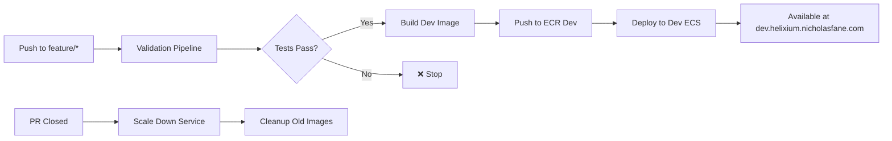

# Feature Branch Development Deployment

This document describes the automated development deployment pipeline for feature branches, enabling preview deployments at `dev.helixium.nicholasfane.com`.

## Overview

When you push to any `feature/*` branch, the system automatically:

1. **Validates** your changes (linting, tests, build)
2. **Builds** a Docker image and pushes to dev ECR repository
3. **Deploys** to a development ECS service
4. **Makes available** at `https://dev.helixium.nicholasfane.com`
5. **Cleans up** when the PR is closed/merged

## Architecture

### Infrastructure Components

- **Dev ECS Service**: `helixium-dev-service` (separate from production)
- **Dev ECR Repository**: `helixium-web-dev` (isolated from production images)
- **Dev Subdomain**: `dev.helixium.nicholasfane.com` (separate SSL certificate)
- **Cost Optimization**: Auto-scales down to 0 when not in use

### Workflow Integration



## Usage

### Automatic Deployment

1. **Create feature branch**:

   ```bash
   git checkout main
   git pull origin main
   git checkout -b feature/my-new-feature
   ```

2. **Make changes and push**:

   ```bash
   # Make your changes
   git add .
   git commit -m "implement new feature"
   git push -u origin feature/my-new-feature
   ```

3. **Automatic deployment triggers**:
   - Validation pipeline runs (linting, tests, build)
   - If validation passes, dev deployment starts
   - Docker image built and pushed to dev ECR
   - Dev ECS service updated with new image
   - Available at `https://dev.helixium.nicholasfane.com`

### Manual Deployment

You can also trigger deployment manually:

1. **Via GitHub Actions**:
   - Go to Actions → "Feature Branch Dev Deployment"
   - Click "Run workflow"
   - Select your branch
   - Click "Run workflow"

### Viewing Deployments

- **Dev Environment**: https://dev.helixium.nicholasfane.com
- **GitHub Actions**: Monitor deployment progress
- **CloudWatch Logs**: `/ecs/helixium-dev` log group
- **Slack Notifications**: Automatic updates on deployment status

## Development Workflow

### Typical Feature Development

1. **Branch Creation**:

   ```bash
   git checkout -b feature/user-authentication
   ```

2. **Development Loop**:

   ```bash
   # Make changes
   git add .
   git commit -m "add login form"
   git push  # Triggers deployment

   # Test at dev.helixium.nicholasfane.com
   # Make more changes
   git add .
   git commit -m "fix validation logic"
   git push  # Updates deployment
   ```

3. **Testing & Iteration**:

   - Each push updates the dev environment
   - Test your changes at `dev.helixium.nicholasfane.com`
   - Iterate quickly with real environment testing

4. **Pull Request**:

   ```bash
   # When ready, create PR
   gh pr create --title "Feature: User Authentication" --body "Implements login/logout functionality"
   ```

5. **Automatic Cleanup**:
   - When PR is merged/closed, dev service scales down to 0
   - Saves costs when not actively developing

### Branch Naming

- **Required prefix**: `feature/`
- **Good examples**:
  - `feature/user-authentication`
  - `feature/payment-integration`
  - `feature/dashboard-redesign`
  - `feature/bug-fix-navigation`

## Cost Management

### Automatic Cost Optimization

1. **Scale to Zero**: Dev service automatically scales down when not in use
2. **Image Cleanup**: Old ECR images automatically removed (keeps 5 most recent)
3. **Resource Limits**: Dev service uses minimal resources (256 CPU, 512 MB)

### Manual Cost Controls

- **Force Cleanup**: Run "Feature Branch Cleanup" workflow manually
- **Monitor Usage**: Check ECS console for service status
- **ECR Costs**: Images automatically cleaned up after PR closure

## Infrastructure Setup

### Prerequisites

1. **Terraform Deployment**:

   ```bash
   cd terraform
   terraform apply  # Deploys dev-environment.tf
   ```

2. **DNS Configuration**:

   - Add DNS record: `dev.helixium.nicholasfane.com` → ALB
   - SSL certificate includes both main and dev subdomains

3. **GitHub Secrets**:
   - `AWS_ACCESS_KEY_ID`: AWS credentials
   - `AWS_SECRET_ACCESS_KEY`: AWS credentials
   - `SLACK_BOT_TOKEN`: Slack notifications
   - `SLACK_CHANNEL_ID`: Slack channel

### Infrastructure Files

- `terraform/dev-environment.tf`: Dev ECS service and related resources
- `terraform/domain.tf`: Updated SSL certificate for dev subdomain
- `.github/workflows/feature-branch-deployment.yml`: Main deployment workflow
- `.github/workflows/feature-branch-cleanup.yml`: Cleanup workflow

## Monitoring & Troubleshooting

### Deployment Monitoring

1. **GitHub Actions**:

   - Check workflow status in Actions tab
   - View logs for detailed deployment steps

2. **AWS Console**:

   - **ECS**: Monitor service status and task health
   - **CloudWatch**: View application logs
   - **ECR**: Check image builds and pushes

3. **Slack Notifications**:
   - Deployment success/failure alerts
   - Cleanup notifications
   - Direct links to workflow logs

### Common Issues

#### Deployment Fails

1. **Check validation step**: Ensure tests pass
2. **Infrastructure status**: Verify dev service exists
3. **AWS permissions**: Check credentials and policies
4. **Image build**: Review Docker build logs

#### Dev Site Not Loading

1. **Service status**: Check if ECS service is running
2. **Target group health**: Verify health checks pass
3. **DNS propagation**: Wait for DNS updates (up to 5 minutes)
4. **SSL certificate**: Ensure cert covers dev subdomain

#### Cost Concerns

1. **Check service scale**: Verify service scaled down after PR closure
2. **Image cleanup**: Run cleanup workflow if needed
3. **Monitor usage**: Use AWS Cost Explorer for detailed costs

### Troubleshooting Commands

```bash
# Check dev service status
aws ecs describe-services \
  --cluster helixium-cluster \
  --services helixium-dev-service

# View recent dev logs
aws logs tail /ecs/helixium-dev --follow

# Check ECR images
aws ecr describe-images \
  --repository-name helixium-web-dev \
  --query 'imageDetails[*].[imageTags[0],imagePushedAt]'

# Scale down dev service manually
aws ecs update-service \
  --cluster helixium-cluster \
  --service helixium-dev-service \
  --desired-count 0
```

## Security Considerations

### Isolation

- **Separate ECR repository**: Dev images isolated from production
- **Separate ECS service**: Dev environment isolated from production
- **Environment variables**: Different configs for dev vs production

### Access Control

- **GitHub Actions**: Uses same AWS credentials as production (consider separate dev role)
- **Public access**: Dev environment publicly accessible at dev subdomain
- **Temporary nature**: Deployments are temporary and automatically cleaned up

### Best Practices

1. **Don't deploy secrets**: Avoid committing secrets to feature branches
2. **Test data**: Use test/mock data in dev environment
3. **Resource limits**: Keep dev resources minimal for cost control
4. **Regular cleanup**: Monitor and clean up old deployments

## Integration with Existing Workflow

### Compatibility

- **Existing validation**: Reuses `helixium-web-validation.yml` workflow
- **Production deployment**: Unchanged, still deploys from main branch
- **PR process**: Standard PR workflow continues to work
- **Branch protection**: Works with existing branch protection rules

### Workflow Triggers

1. **Feature branch push**: Triggers dev deployment
2. **Main branch push**: Triggers production deployment (existing)
3. **PR creation**: Triggers validation only (existing)
4. **PR closure**: Triggers cleanup

## Future Enhancements

### Potential Improvements

1. **Multiple environments**: Support for `staging/` branch deployments
2. **Preview URLs**: Unique URLs per branch (e.g., `feature-auth.dev.helixium.nicholasfane.com`)
3. **Database isolation**: Separate dev databases per branch
4. **Integration testing**: Automated integration tests against dev environment
5. **Performance monitoring**: APM integration for dev environment

### Monitoring Enhancements

1. **Cost tracking**: Detailed cost attribution per branch
2. **Usage analytics**: Track dev environment usage patterns
3. **Performance metrics**: Monitor dev environment performance
4. **Automated alerts**: Notifications for failed deployments or cost overruns

---

This development deployment pipeline enables rapid iteration and testing while maintaining cost efficiency and production isolation.
